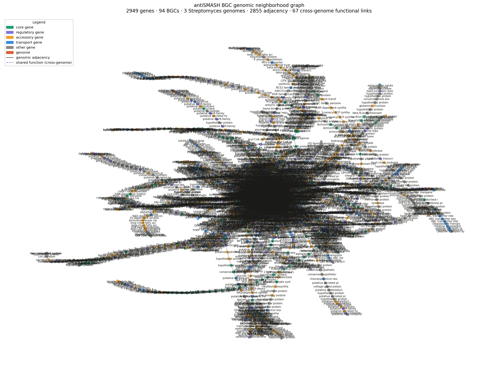

# BGC Protein Role Classifier — ESM-2 Embeddings + Genomic Knowledge Graphs

Classifying **core, regulatory, accessory, and transport proteins** within Biosynthetic Gene Clusters (BGCs) using protein language model embeddings, and visualizing their genomic organization through interactive knowledge graphs.

Built as a direct contribution to the problem addressed by the **iGEM USP S(H)ARP 2026** project: current BGC prediction tools focus almost exclusively on core biosynthetic enzymes, ignoring the regulatory and accessory proteins that govern whether a silent pathway gets activated. This repository attacks that problem from two complementary angles — sequence-level classification and genomic context visualization.

---

## Motivation

Tools like antiSMASH identify BGC boundaries and classify clusters by type, but treat all proteins within a cluster with limited functional granularity. The S(H)ARP approach proposes to incorporate regulatory and accessory proteins into BGC analysis — a biologically motivated improvement that can reveal silent pathways in *Streptomyces* and other Actinobacteria.

This repository explores two questions:

1. **Can a protein language model distinguish core biosynthetic enzymes from regulatory and accessory proteins using sequence information alone?** (Project 1 — classifier)
2. **How are functional roles spatially organized on the chromosome, and are those patterns conserved across *Streptomyces* species?** (Project 2 — knowledge graphs)

---

## Project 1 — ESM-2 Protein Role Classifier

### Dataset

- **Source:** [MIBiG 4.0](https://mibig.secondarymetabolites.org/) — curated repository of experimentally characterized BGCs
- **Filter:** Actinobacteria only (focus on *Streptomyces* and related genera)
- **Labels:** protein functional role — `core`, `regulatory`, `accessory`, `transport`, `other`
- **Label source:** MIBiG JSON annotations (curated) + heuristic keyword fallback

### Pipeline

```
FASTA + JSON (MIBiG 4.0)
        │
        ▼
01_download_mibig.py      Parse proteins + roles → CSV
        │
        ▼
02_generate_embeddings.py ESM-2 (8M) mean-pooled embeddings → (N, 320) array
        │
        ▼
03_train_classifier.py    Random Forest + Logistic Regression, 5-fold CV
        │
        ▼
04_visualize.py           t-SNE · confusion matrix · role × BGC type
```

**Embedding model:** [ESM-2 esm2_t6_8M_UR50D](https://github.com/facebookresearch/esm) (Meta AI) — 8M parameters, 320-dimensional representations, runs on CPU.

**Why ESM-2?** Unlike classical sequence features (amino acid composition, k-mers), ESM-2 embeddings encode evolutionary and structural context learned from 250M protein sequences. Proteins with similar function tend to cluster in embedding space regardless of sequence similarity — making it suitable for detecting regulatory proteins that share functional but not necessarily sequence similarity with known examples.

### Results

| Model | Macro F1 |
|---|---|
| Random Forest | **see results/metrics_summary.json** |
| Logistic Regression | **see results/metrics_summary.json** |

#### t-SNE of ESM-2 embeddings by protein role


*Each point is one protein. Colors indicate functional role. Visible clustering shows that ESM-2 representations carry meaningful functional signal — core enzymes (green) occupy distinct regions from regulatory proteins (purple).*

#### Confusion matrix


#### Role distribution by BGC type


---

### Reproducing

```bash
# 1. Install dependencies
pip install -r requirements.txt

# 2. Download and parse MIBiG 4.0 (Actinobacteria only)
python 01_download_mibig.py --output data/raw/

# 3. Generate ESM-2 embeddings
python 02_generate_embeddings.py --input data/raw/mibig_proteins.csv \
                                  --output data/processed/

# 4. Train classifier
python 03_train_classifier.py --input data/processed/ --output results/

# 5. Generate figures
python 04_visualize.py --embeddings data/processed/embeddings.npy \
                        --metadata data/processed/metadata.csv \
                        --predictions results/predictions.csv \
                        --output figures/
```


### Reproducing with Nextflow (Recommended)

To run the entire pipeline with a single command (ensuring full reproducibility and generating execution reports):

```bash
nextflow run main.nf
```

The pipeline will automatically:

   1. Download and parse MIBiG data.

   2. Generate ESM-2 embeddings.

   3. Train and evaluate the classifier.

   4. Visualize results and output an HTML report of the execution.

Tested on Python 3.14, CPU only. Full pipeline took ~120 minutes on a laptop with Intel i7-5500U CPU.


---

## Project 2 — Genomic Neighborhood Interactive Knowledge Graphs

Two interactive graphs exploring how functional roles are spatially organized within BGCs.
Both are HTML files hosted on GitHub Pages, so you can open them in any browser, drag nodes, and hover for details.

### Graph A — MIBiG genomic neighborhood

> **[Open interactive graph](https://ecdyzone.github.io/sharp-bgc-classifier/figures/knowledge_graph.html)**

Built from MIBiG 4.0 experimentally validated BGCs. Genomic coordinates are parsed directly from the FASTA headers (`start–end` field), so genes are connected by **physical adjacency on the chromosome** — not co-occurrence.

**Node types:**
- Colored circles = individual genes, colored by functional role (core / regulatory / accessory / transport / other)

**Edge types:**
- Solid black = genomic adjacency (consecutive genes sorted by chromosomal position within a BGC)
- Dashed purple = cross-BGC functional similarity (same functional keyword, different BGCs)

**What it reveals:** the spatial distribution of regulatory and accessory genes relative to core biosynthetic genes across all experimentally validated Actinobacteria BGCs in MIBiG — the baseline against which silent cluster organization can be compared.


```bash
python 05_knowledge_graph.py \
    --fasta  data/raw/mibig_prot_seqs_4.0.fasta \
    --csv    data/raw/mibig_proteins.csv \
    --output figures/ --results results/ --n-bgcs 30
```

---

### Graph B — antiSMASH multi-genome BGC graph

> 🔗 **[Open interactive graph](https://ecdyzone.github.io/sharp-bgc-classifier/figures/antismash_graph.html)**

Built from antiSMASH *de novo* BGC predictions across three *Streptomyces* genomes:

| Genome | Organism | Accession |
|---|---|---|
| AL645882 | *Streptomyces coelicolor* A3(2) | [AL645882](https://www.ncbi.nlm.nih.gov/nuccore/AL645882) |
| CP009124 | *Streptomyces avermitilis* MA-4680 | [CP009124](https://www.ncbi.nlm.nih.gov/nuccore/CP009124) |
| CP029197 | *Streptomyces venezuelae* ATCC 10712 | [CP029197](https://www.ncbi.nlm.nih.gov/nuccore/CP029197) |

**Node types:**
- Colored circles = BGC genes, colored by functional role
- Orange squares = genome anchors (one per organism)

**Edge types:**
- Solid black = genomic adjacency (consecutive genes within a predicted BGC)
- Dashed purple = cross-genome functional similarity (same functional keyword, different species)

**Role assignment priority:**
1. CDS overlapping `proto_core` boundary → `core` (antiSMASH ground truth)
2. `gene_kind` qualifier from antiSMASH annotation
3. `gene_functions` qualifier
4. Heuristic keyword match on product name

**What it reveals:** functional organization of *predicted* BGCs — including silent/cryptic clusters — across three species. Cross-genome dashed edges show conserved functional modules that appear independently in unrelated biosynthetic pathways, the most promising candidates for the S(H)ARP activation strategy.



```bash
python 05b_antismash_graph.py \
    --jsons AL645882.json CP009124.json CP029197_1.json \
    --output figures/ --results results/
```

---

## Next steps

- [x] Download and parse MIBiG 4.0 (Actinobacteria filter)
- [x] Generate ESM-2 protein embeddings
- [x] Train and evaluate role classifier (Random Forest + Logistic Regression)
- [x] Visualize embeddings with t-SNE, confusion matrix, role × BGC type
- [x] MIBiG genomic neighborhood knowledge graph (05_knowledge_graph.py)
- [x] antiSMASH multi-genome knowledge graph across 3 Streptomyces species (05b_antismash_graph.py)
- [x] Deploy both interactive graphs to GitHub Pages
- [x] Nextflow pipeline wrapping all project 1 scripts (see `main.nf`)
- [ ] Nextflow pipeline wrapping all project 1+2 scripts
- [ ] Extend classifier to full MIBiG (all taxa) and evaluate cross-taxa generalization
- [ ] Fine-tune ESM-2 on MIBiG with contrastive learning for improved role separation
- [ ] Integrate antiSMASH output directly into classifier pipeline (end-to-end BGC annotation)
- [ ] Quantify regulatory/accessory gene proximity to core genes across silent vs active BGCs

---

## Repository structure

```
sharp-bgc-classifier/
├── 01_download_mibig.py          # Download + parse MIBiG 4.0
├── 02_generate_embeddings.py     # ESM-2 embeddings
├── 03_train_classifier.py        # Random Forest + Logistic Regression
├── 04_visualize.py               # t-SNE, confusion matrix, role distribution
├── 05_knowledge_graph.py         # MIBiG genomic neighborhood graph
├── 05b_antismash_graph.py        # antiSMASH multi-genome graph
├── main.nf                       # Nextflow pipeline (in progress)
├── nextflow.config               # Nextflow config
├── data/
│   ├── raw/                      # MIBiG FASTA + CSV; antiSMASH JSON
│   └── processed/                # Embeddings + metadata
├── figures/                      # All output figures + interactive HTMLs
├── results/                      # Metrics, stats JSONs
└── requirements.txt
```

---

## References

> For the bibtex file with those references, check [`references.bib`](./references.bib)

- Lin et al. (2023). Evolutionary-scale prediction of atomic-level protein structure with a language model. *Science*.
- Terlouw et al. (2023). MIBiG 3.0: a community-driven effort to annotate experimentally validated biosynthetic gene clusters. *Nucleic Acids Research*.
- Blin et al. (2023). antiSMASH 7.0: new and improved predictions for detection, regulation, and visualisation. *Nucleic Acids Research*.

---

## Limitations

This is a toy project made in less than a week with the help of Anthropic's Claude.ai. The goal was to get a feeling for the work involved in this iGem project. I know there are many things to improve, and I'd be happy with any contribution.
