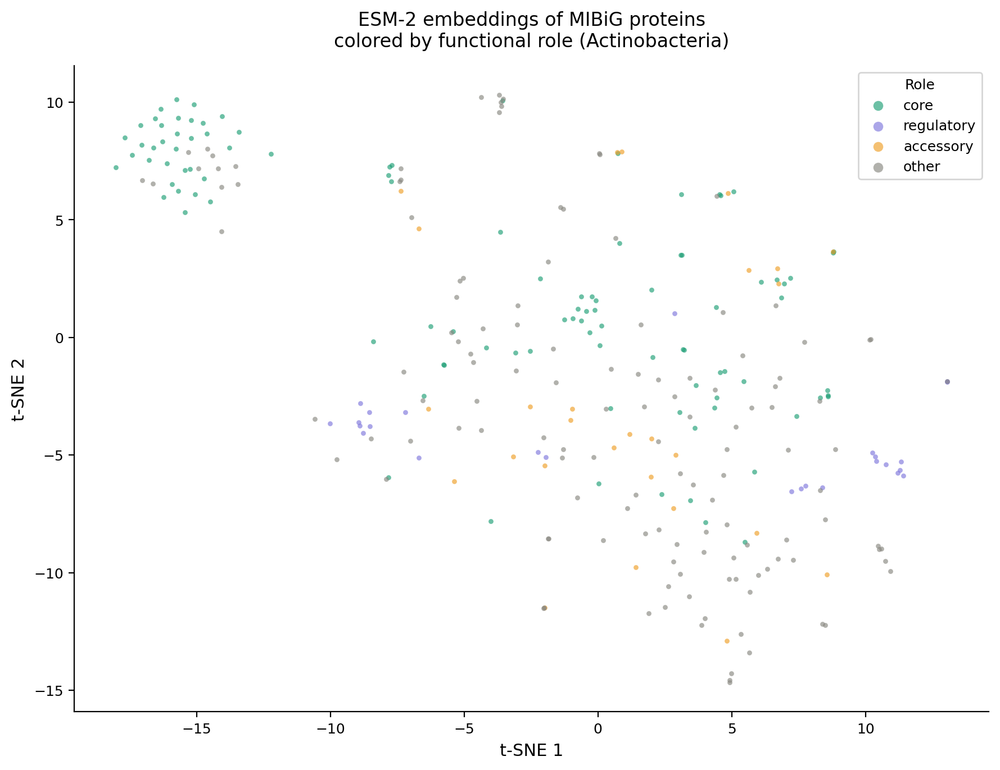
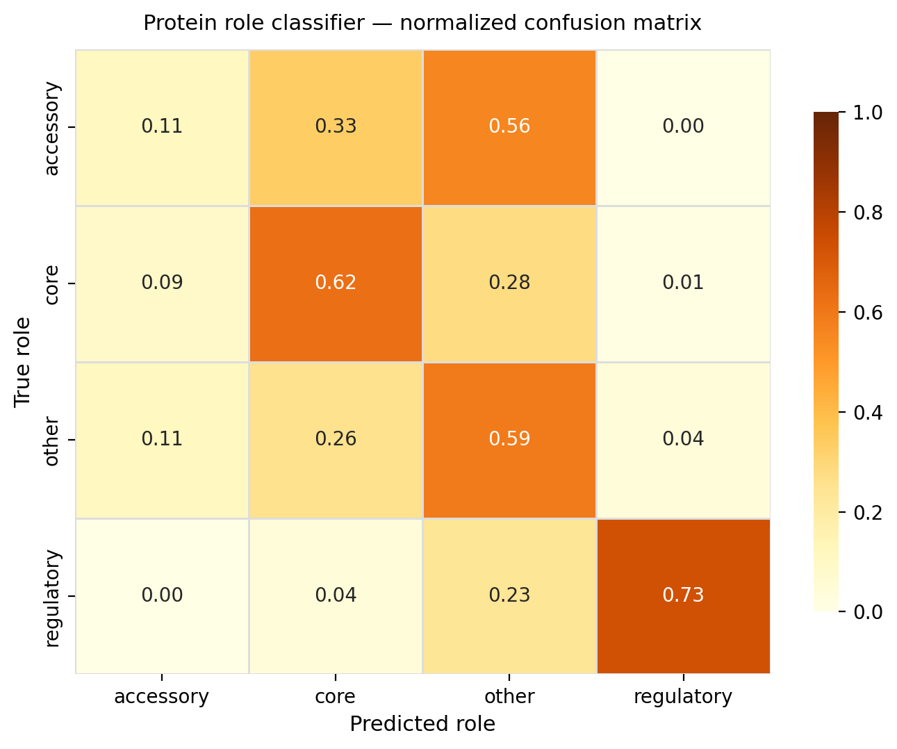
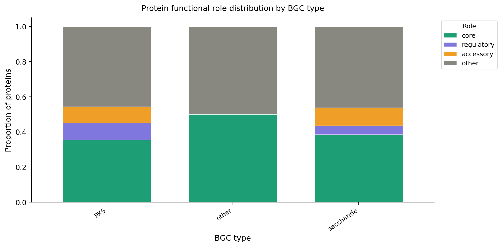
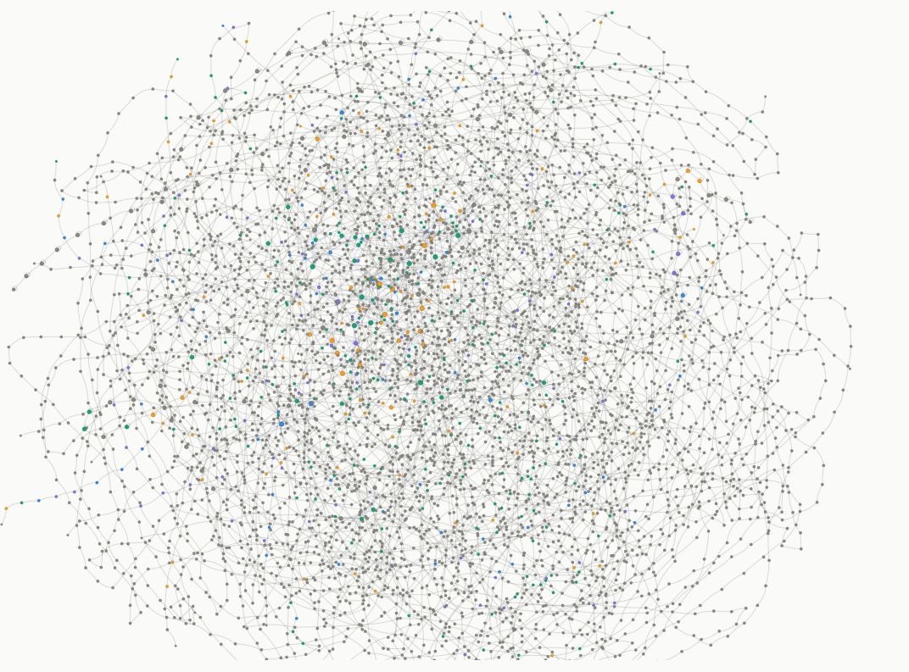
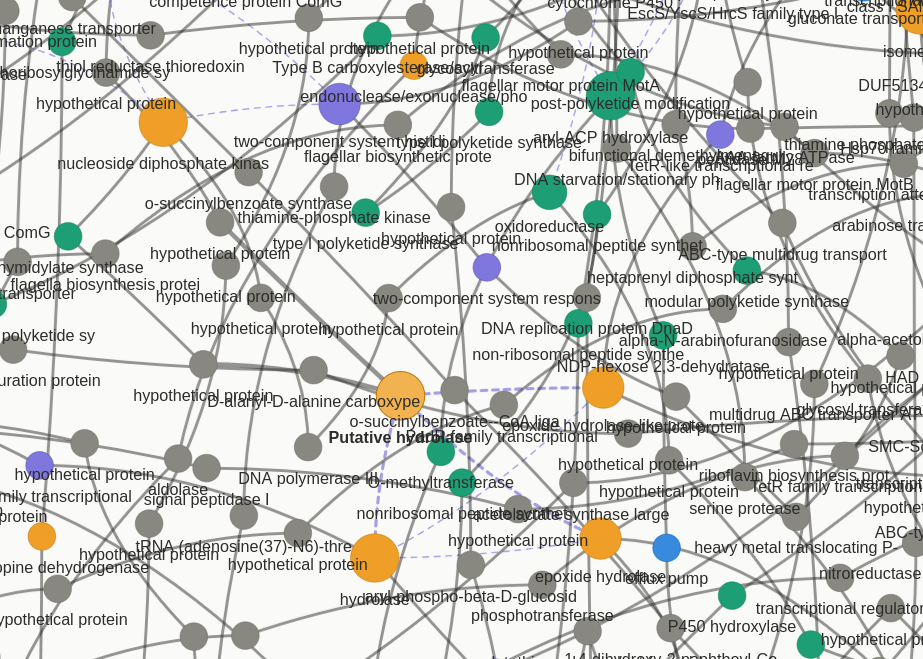

# BGC Protein Role Classifier — ESM-2 Embeddings

Classifying **core, regulatory, accessory, and transport proteins** within Biosynthetic Gene Clusters (BGCs) using protein language model embeddings.

This project was built as a direct contribution to the problem addressed by the **iGEM USP S(H)ARP 2026** project: current BGC prediction tools focus almost exclusively on core biosynthetic enzymes, largely ignoring the regulatory and accessory proteins that govern whether a silent pathway gets activated. This classifier is a first step toward a more complete genomic context model.

---

## Motivation

Tools like antiSMASH identify BGC boundaries and classify clusters by type, but treat all proteins within a cluster with limited functional granularity. The S(H)ARP approach proposes to incorporate regulatory and accessory proteins into BGC analysis — a biologically motivated improvement that can reveal silent pathways in *Streptomyces* and other Actinobacteria.

This repository explores the question: **can a protein language model distinguish core biosynthetic enzymes from regulatory and accessory proteins within BGCs, using sequence information alone?**

---

## Dataset

- **Source:** [MIBiG 4.0](https://mibig.secondarymetabolites.org/) — curated repository of experimentally characterized BGCs
- **Filter:** Actinobacteria only (focus on *Streptomyces* and related genera)
- **Labels:** protein functional role — `core`, `regulatory`, `accessory`, `transport`, `other`
- **Label source:** MIBiG JSON annotations (curated) + heuristic keyword fallback

---

## Method

```
FASTA + JSON (MIBiG 4.0)
        │
        ▼
01_download_mibig.py      Parse proteins + roles → CSV
        │
        ▼
02_generate_embeddings.py ESM-2 (8M) mean-pooled embeddings → (N, 320) array
        │
        ▼
03_train_classifier.py    Random Forest + Logistic Regression, 5-fold CV
        │
        ▼
04_visualize.py           t-SNE · confusion matrix · role × BGC type
```

**Embedding model:** [ESM-2 esm2_t6_8M_UR50D](https://github.com/facebookresearch/esm) (Meta AI) — 8M parameters, 320-dimensional representations, runs on CPU.

**Why ESM-2?** Unlike classical sequence features (amino acid composition, k-mers), ESM-2 embeddings encode evolutionary and structural context learned from 250M protein sequences. Proteins with similar function tend to cluster in embedding space regardless of sequence similarity — making it suitable for detecting regulatory proteins that share functional but not necessarily sequence similarity with known examples.

---

## Results

| Model | Macro F1 |
|---|---|
| Random Forest | **see results/metrics_summary.json** |
| Logistic Regression | **see results/metrics_summary.json** |

### t-SNE of ESM-2 embeddings by protein role



*Each point is one protein. Colors indicate functional role. Visible clustering shows that ESM-2 representations carry meaningful functional signal — core enzymes (green) occupy distinct regions from regulatory proteins (purple).*

### Confusion matrix



### Role distribution by BGC type




### Interactive Knowledge Graph

**This interactive HTML is available online. Try it here: https://ecdyzone.github.io/sharp-bgc-classifier/figures/knowledge_graph.html**





---

## Reproducing

```bash
# 1. Install dependencies
pip install -r requirements.txt

# 2. Download and parse MIBiG (Actinobacteria only)
python 01_download_mibig.py --output data/raw/

# 3. Generate ESM-2 embeddings
python 02_generate_embeddings.py --input data/raw/mibig_proteins.csv \
                                  --output data/processed/

# 4. Train classifier
python 03_train_classifier.py --input data/processed/ --output results/

# 5. Generate figures
python 04_visualize.py --embeddings data/processed/embeddings.npy \
                        --metadata data/processed/metadata.csv \
                        --predictions results/predictions.csv \
                        --output figures/
```

Tested on Python 3.11, CPU only. Full pipeline takes ~30–60 min depending on dataset size.


### Reproducing with Nextflow (Recommended)

To run the entire pipeline with a single command (ensuring full reproducibility and generating execution reports):

```bash
nextflow run main.nf
```

The pipeline will automatically:

   1. Download and parse MIBiG data.

   2. Generate ESM-2 embeddings.

   3. Train and evaluate the classifier.

   4. Visualize results and output an HTML report of the execution.

---

## Next steps

- [X] Nextflow pipeline wrapping all four scripts
- [ ] Knowledge graph of BGC genomic context (NetworkX + Pyvis)
- [ ] Extend to full MIBiG (all taxa) and evaluate cross-taxa generalization
- [ ] Fine-tune ESM-2 on MIBiG with contrastive learning for improved role separation
- [ ] Integration with antiSMASH output for end-to-end BGC annotation

---

## References

> For the bibtex file with those references, check [`references.bib`](./references.bib)

- Lin et al. (2023). Evolutionary-scale prediction of atomic-level protein structure with a language model. *Science*.
- Terlouw et al. (2023). MIBiG 3.0: a community-driven effort to annotate experimentally validated biosynthetic gene clusters. *Nucleic Acids Research*.
- Blin et al. (2023). antiSMASH 7.0: new and improved predictions for detection, regulation, and visualisation. *Nucleic Acids Research*.


## Limitations

This is a toy project made in less than a week with the help of Anthropic's Claude.ai. The goal was to get a feeling for the work involved in this iGem project. I know there are many things to improve, and I'd be happy with any contribution.
